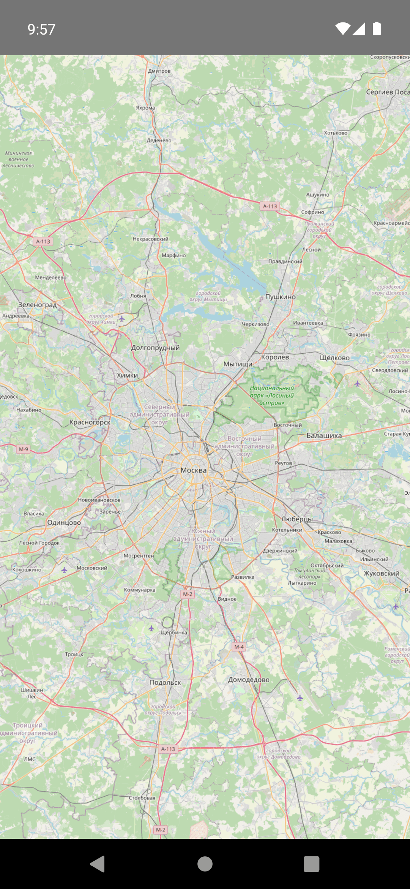
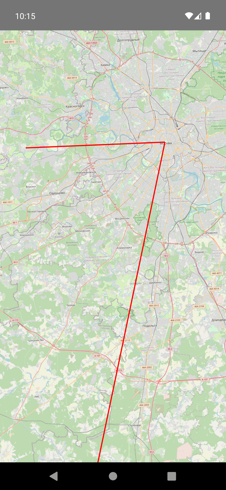
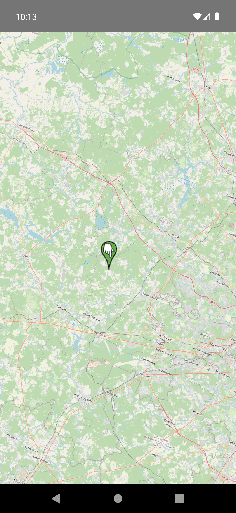
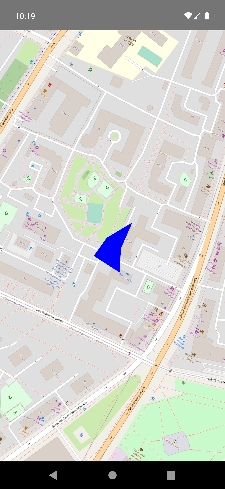
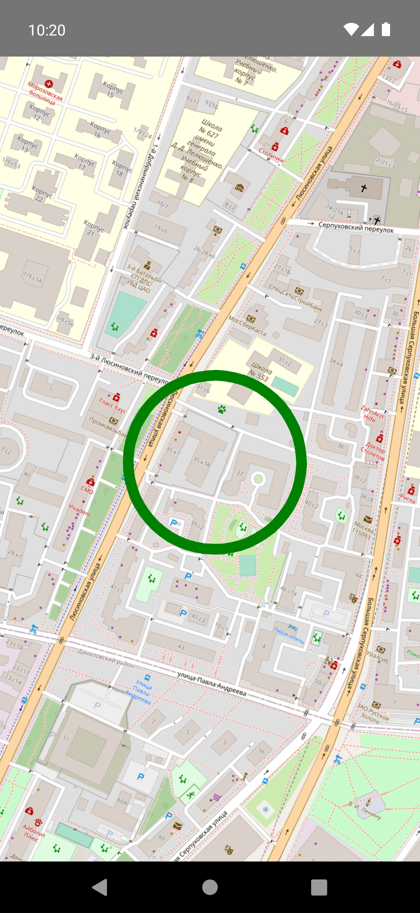
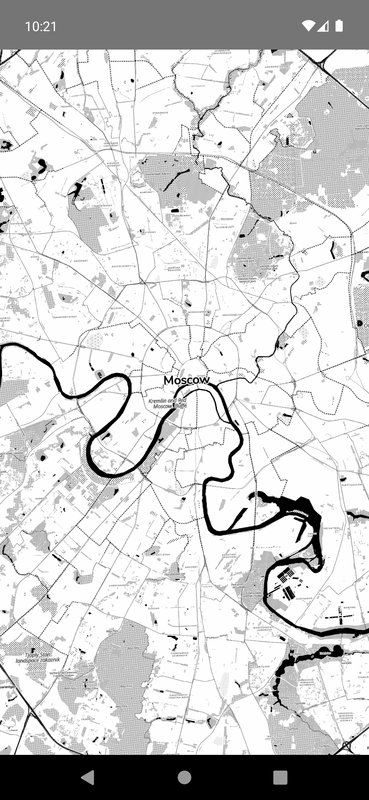

# react-native-osmdroid [](https://www.npmjs.com/package/@milad445/react-native-osmdroid) [](http://www.npmtrends.com/@milad445/react-native-osmdroid)

> **⚠️ BETA VERSION 1.1.1-beta.0**  
> This is a beta release with significant improvements to offline mode and local tile functionality. While comprehensive testing has been done, this version is not yet considered stable for production use. Please test thoroughly in your development environment before deploying to production.
>
> **What's New in Beta:**
> - ✅ **Enhanced Offline Mode**: Properly implemented offline tile providers for true offline functionality
> - ✅ **Local File Storage**: Full support for `file://` protocol to read tiles from local filesystem
> - ✅ **Improved Tile Caching**: Proper cache configuration with expiration control
> - ✅ **Better Performance**: Optimized tile loading and network management
>
> **Installation (Beta):**
> ```sh
> npm install @milad445/react-native-osmdroid@1.1.1-beta.0
> ```

React Native Open Street Maps components for Android.
This is unofficial React Native wrapper for Osmdroid SDK.
Many thanks to [fqborges](https://github.com/fqborges) for his [library](https://github.com/fqborges/react-native-maps-osmdroid), which is the basis of this library!
## Installation

```sh
npm install @milad445/react-native-osmdroid
```

## 🆕 Offline Mode & Local Tiles (Beta Feature)

**Version 1.1.1-beta** introduces comprehensive offline functionality and local file storage support for tiles.

### Overview

This beta version provides three ways to work with map tiles:

1. **🔌 Offline Mode**: Uses tiles cached from previous online sessions. Perfect for apps that need to work without internet after initial cache.
2. **📁 Local Storage**: Reads tiles directly from device filesystem using `file://` protocol. Ideal for pre-packaged maps or custom tile sets.
3. **🔄 Hybrid Mode**: Automatically switches between online and offline based on network availability. Best for apps that should work in any condition.

---

### 1️⃣ Offline Mode with Cached Tiles

**How it works**:
- `UrlTile` downloads online tiles and stores them under `tileCachePath` while online.
- When `offlineMode={true}`, network tile requests are disabled and only cached tiles are used.
- For reliable offline behavior, pre-visit or pre-cache the target area/zoom levels first.

**When to use this mode**:
- You use an online provider but need operation without connectivity.
- You want to reduce bandwidth after first load.
- You need controlled cache expiration behavior.

**Setup checklist**:
1. Use an online `urlTemplate`.
2. Set a writable `tileCachePath`.
3. Warm the cache while online (browse the area/zoom levels you need).
4. Switch to `offlineMode={true}` for no-network operation.

**Example (same layer, online → offline)**:

```jsx
import { useState } from 'react';
import { MapView, UrlTile } from '@milad445/react-native-osmdroid';

function OfflineReadyMap() {
  const [offlineMode, setOfflineMode] = useState(false);

  return (
    <MapView
      initialRegion={{
        latitude: 37.7749,
        longitude: -122.4194,
        latitudeDelta: 0.0922,
        longitudeDelta: 0.0421,
      }}
      style={{ flex: 1 }}
    >
      <UrlTile
        urlTemplate="https://tile.openstreetmap.org/{z}/{x}/{y}.png"
        offlineMode={offlineMode}
        tileCachePath="/storage/emulated/0/osmdroid"
        tileCacheMaxAge={0}
        minimumZ={0}
        maximumZ={18}
      />
    </MapView>
  );
}
```

**Important notes**:
- `offlineMode={true}` does not fetch missing tiles; they must already exist in cache.
- `tileCacheMaxAge={0}` means no expiration override refresh window.
- Use Android storage permissions appropriate to your target SDK/device.

### 2️⃣ Local Storage (file:// protocol)

**How it works**: Reads tiles directly from your device's filesystem. Provide a base directory path and the library resolves tiles in `/{z}/{x}/{y}.{ext}` format. No network connection is ever used.

**Pure offline usage (no SIM, no Wi-Fi):**
- Turn on airplane mode (or disable both mobile data and Wi-Fi).
- Use `offlineMode={true}` with a `file://` base directory.
- Keep path separators as `/` in the URI (not `\`).
- Ensure local tiles exist in `/{z}/{x}/{y}.png` (or `.jpg` / `.jpeg` / `.webp`) for the zoom levels you plan to view.
- If a tile does not exist on disk for a zoom/coordinate, it cannot be fetched in pure offline mode.
- In this mode, tiles are read directly from local storage files, not from network.

**Use cases**:
- Hiking or outdoor apps with pre-packaged maps
- Aviation or maritime charts
- Custom offline maps for specific regions
- Apps that must work 100% offline

**Example**:

```jsx
import { MapView, UrlTile } from '@milad445/react-native-osmdroid';

<MapView
  initialRegion={{
    latitude: 37.7749,
    longitude: -122.4194,
    latitudeDelta: 0.0922,
    longitudeDelta: 0.0421,
  }}
>
  <UrlTile
    urlTemplate="file:///storage/emulated/0/MyMaps/tiles"
    offlineMode={true}
    minimumZ={0}
    maximumZ={16}
  />
</MapView>
```

**Pure offline local PNG example** (`tiles/{z}/{x}/{y}.png`, direct file read, no connectivity):

```jsx
import { MapView, UrlTile } from '@milad445/react-native-osmdroid';

<MapView
  style={{ flex: 1 }}
  initialRegion={{
    latitude: 37.7749,
    longitude: -122.4194,
    latitudeDelta: 0.2,
    longitudeDelta: 0.2,
  }}
>
  <UrlTile
    urlTemplate="file:///storage/emulated/0/tiles"
    offlineMode={true}
    minimumZ={0}
    maximumZ={18}
  />
</MapView>
```

**Supported file paths**:
- Absolute: `file:///storage/emulated/0/tiles`
- SD Card: `file:///sdcard/maps`
- App data: `file:///data/data/com.yourapp/tiles`

For pure offline/local tiles:
- set `offlineMode={true}`
- use `file://` URL with base directory only
- tiles should exist in `/{z}/{x}/{y}.png` (or `.jpg/.jpeg/.webp`)
- use `/` slashes in `urlTemplate` (not `\`)

---

### 3️⃣ Hybrid Mode (Online/Offline with Network Detection)

**How it works**: Automatically detects network status and switches between online (download + cache) and offline (use cache only) modes. Provides the best user experience across all connectivity scenarios.

**Use cases**:
- General purpose apps
- Apps used in varying connectivity environments
- Navigation apps that should work anywhere
- Any app where connectivity is unpredictable

**Example**:

```jsx
import { MapView, UrlTile } from '@milad445/react-native-osmdroid';
import NetInfo from '@react-native-community/netinfo';

const [isOffline, setIsOffline] = useState(false);

// Detect network status
useEffect(() => {
  const unsubscribe = NetInfo.addEventListener(state => {
    setIsOffline(!state.isConnected);
  });
  return () => unsubscribe();
}, []);

<MapView>
  <UrlTile
    urlTemplate="https://tile.openstreetmap.org/{z}/{x}/{y}.png"
    offlineMode={isOffline}  // Automatically switch based on network
    tileCachePath="/storage/emulated/0/cache"
    tileCacheMaxAge={604800}  // 1 week
    maximumZ={18}
    maximumNativeZ={15}  // Scale tiles beyond zoom 15 to save bandwidth
  />
</MapView>
```

---

### 📊 Quick Comparison

| Feature | Offline Mode | Local Storage | Hybrid Mode |
|---------|--------------|---------------|-------------|
| **Network Required** | Initially (to cache) | Never | Yes (when available) |
| **Data Usage** | Downloads once | None | Minimal (caching) |
| **Setup Complexity** | Low | Medium (pre-download tiles) | Medium (network detection) |
| **Best For** | Occasional offline use | Always offline | Variable connectivity |
| **Storage Control** | Cache management | Full control | Automatic |

---

### Important Notes for Beta:

- **Local tiles** must be organized in `/{z}/{x}/{y}.{ext}` format
- **`file://` local path style**: preferred format is base directory (example: `file:///storage/tiles` or `file:///storage/tiles.jpg`)
- **Legacy compatibility**: `file:///.../{z}/{x}/{y}.png` is still supported
- **File paths** support: absolute (`/storage/...`), SD card (`/sdcard/...`), or `file://` prefix
- **Supported formats**: PNG, JPG, JPEG, WebP
- **Offline mode** disables all network requests and uses only cached/local tiles
- **Pure offline setup**: `offlineMode={true}` + `file://` path + valid storage permissions
- **Cache expiration**: Set `tileCacheMaxAge={0}` for permanent cache, or seconds for auto-expiration
- **Pre-downloading tiles**: Use `TileCacher` (see below) or third-party tools to download tiles before going offline

## Tile Caching with TileCacher

The `TileCacher` feature enables efficient offline map functionality by caching downloaded map tiles on the device's local storage. This allows for improved performance in map tile loading, reducing network requests for previously visited areas and ensuring maps remain accessible without an internet connection.

### How it Works

The `TileCacher` utilizes the `cacheTilesFromDirectory` method to specify the local directory path where map tiles will be cached for offline use. This feature is currently available only on Android.

```js
import { TileCacher } from '@milad445/react-native-osmdroid';

TileCacher.cacheTilesFromDirectory('/storage/emulated/0/map/tiles', { showProgressToast: true });
```

### Directory Structure
The cached tiles must be stored following the "/{z}/{x}/{y}.png" subdirectory pattern, where {z} is the zoom level, and {x} and {y} are the tile coordinates. This structure allows the map component to efficiently locate and load the appropriate tiles based on the current map view.

### Managing Cache Size
It's crucial to manage the cache directory's size to prevent excessive storage usage. Developers are advised to implement a strategy for cache cleanup or limiting the cache size.


## Manifest

In most cases, you will have to set the following authorizations in your AndroidManifest.xml:

```sh
<uses-permission android:name="android.permission.ACCESS_FINE_LOCATION"/>
<uses-permission android:name="android.permission.INTERNET" />
<uses-permission android:name="android.permission.ACCESS_NETWORK_STATE"  />
<uses-permission android:name="android.permission.WRITE_EXTERNAL_STORAGE" />
```

On Android 13 or higher, the `android.permission.READ_MEDIA_IMAGES` permission and `android:requestLegacyExternalStorage="true"` attribute in your AndroidManifest.xml are required to access external storage for tile caching.

```sh
<uses-permission android:name="android.permission.READ_MEDIA_IMAGES"/>
```

Add the `android:requestLegacyExternalStorage="true"` attribute to your application tag if targeting Android 10 (API level 29) or higher.

If you are only using parts of the library, you can adjust the permissions accordingly.

Online tile provider

```sh
<uses-permission android:name="android.permission.INTERNET" />
<uses-permission android:name="android.permission.ACCESS_NETWORK_STATE"  />
```

Offline tile provider and storing tiles

```sh
<uses-permission android:name="android.permission.WRITE_EXTERNAL_STORAGE" />
```

If your tiles are under shared storage, ensure runtime permission flow matches your Android target/device behavior before opening the map screen.

Location provider

```sh
<uses-permission android:name="android.permission.ACCESS_FINE_LOCATION"/>
```

Android 6.0+ devices require you have to check for "dangerous" permissions at runtime.
osmdroid requires the following dangerous permissions:
WRITE_EXTERNAL_STORAGE and ACCESS_COARSE_LOCATION/ACCESS_FINE_LOCATION.
See [OpenStreetMapViewer's implementation](https://github.com/osmdroid/osmdroid/blob/master/OpenStreetMapViewer/src/main/java/org/osmdroid/MainActivity.java#L83) or [Google Documentation on Permissions](https://developer.android.com/training/permissions/requesting)

### Note
This feature is specific to Android. Ensure your app has the necessary permissions to read from and write to the specified directory, particularly on Android, where runtime permissions are required for accessing external storage.

### Usage Example
```js
import React from 'react';
import { Button, View } from 'react-native';
import MapView, { UrlTile, TileCacher } from '@milad445/react-native-osmdroid';

export default function App() {
  const cacheTiles = () => {
    TileCacher.cacheTilesFromDirectory('/storage/emulated/0/map/tiles', { showProgressToast: true });
  };

  return (
    <View style={{ flex: 1 }}>
      <Button title="Cache Tiles" onPress={cacheTiles} />
      <MapView style={{ flex: 1 }}>
        <UrlTile urlTemplate="" />
      </MapView>
    </View>
  );
}
```
Note: Caching process duration is proportional to the number of tiles. Large datasets may take longer to cache.

## Component API

[`<MapView />` Component API](docs/mapview.md)

[`<Marker />` Component API](docs/marker.md)

[`<Callout />` Component API](docs/callout.md)

[`<Polygon />` Component API](docs/polygon.md)

[`<Polyline />` Component API](docs/polyline.md)

[`<Circle />` Component API](docs/circle.md)

[`<Overlay />` Component API](docs/overlay.md)

[`<Heatmap />` Component API](docs/heatmap.md)

[`<Geojson />` Component API](docs/geojson.md)

[`<URLTile />` and `<WMSTile />` Component API](docs/tiles.md)

## Usage

```js
import MapView from '@milad445/react-native-osmdroid';

// ...
<MapView
  initialRegion={{
    latitude: 37.78825,
    longitude: -122.4324,
    latitudeDelta: 0.0922,
    longitudeDelta: 0.0421,
  }}
/>;
```

## Examples
### MapView


### Polyline


### Marker


### Polygon


### Circle


### UrlTile


## Contributing

See the [contributing guide](CONTRIBUTING.md) to learn how to contribute to the repository and the development workflow.

## License

MIT

---

Made with [create-react-native-library](https://github.com/callstack/react-native-builder-bob)
